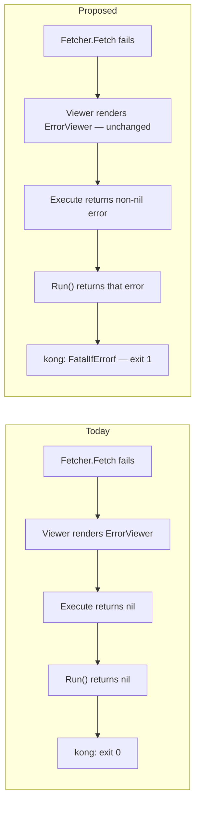

# ADR-0017: Command error propagation and exit-code fidelity

## Status

Accepted (implemented; see "Implementation Note" below for a refinement discovered during
implementation)

## Context

`executor.CommandExecutor[T].Execute` (`executor/executor.go`) is the pipeline nearly every
leaf command runs through:

```go
func (exe *CommandExecutor[T]) Execute(ctx context.Context) error {
	start := time.Now()
	data, err := exe.Fetcher.Fetch(ctx)
	view := exe.Viewer(data, err)
	view.View()
	if view.IsErrorView() {
		return nil
	}
	...
	return nil
}
```

`Execute` **always returns `nil`**. When `Fetcher.Fetch` fails — AWS API error, not-found,
permission-denied, throttling, anything — the failure is rendered as a red `ErrorViewer` banner
and then `Execute` still reports success to its caller. That `nil` flows back through the leaf
command's `Run(ctx, cli) error` (`provider/aws/cli/services/{ec2,s3}.go`) to
`kongCtx.Run(&cli.CLIFlag)` in `main.go`, and `kongCtx.FatalIfErrorf(nil)` is a no-op — the
process exits 0.

Confirmed by tracing kong v0.7.1's own exit path (`FatalIfErrorf` → `Fatalf` → `Errorf` + `Exit`,
`Exit` defaulting to `os.Exit`): the **only** errors that ever produce exit code 1 today are
ones raised *before* the executor pipeline runs — credential/region resolution failures in
`aws.NewSessionV2`, or executor-constructor failures — plus `discover aws`
(`provider/aws/cli/services/discover.go`), which bypasses `CommandExecutor` entirely and returns
its errors directly.

This is a real problem specifically because `cloudctl` is a CLI meant to be scripted: `ctl aws
s3 def some-bucket && do-something` or a CI step checking `$?` will proceed on the success path
even when the bucket lookup failed, because the failure only ever reached stdout as colored text,
never the exit code.

Two related error-fidelity gaps compound this:

1. **`CompoundViewer.IsErrorView()`** (`viewer/compound.go`) only returns `true` when there is
   exactly one child viewer and it is itself an error view. Commands that render multiple
   sections (`ec2 def`, `ec2 explain`, `s3 impact`) can have one sub-section fail — e.g.
   `renderInstanceVolumeSummary` returning `ctlaws.ErrorView(...)` for a failed volume lookup
   inside an otherwise-successful `instanceInfoViewer` — without the overall view ever being
   flagged as an error, even under a corrected `Execute`.
2. **`AWSError()`** (`provider/aws/error.go:49-55`) reformats a `smithy.APIError` via
   `fmt.Errorf("[code:%s, message:%s]", apiErr.ErrorCode(), apiErr.ErrorMessage())` with no
   `%w` verb, discarding the original error from the chain. `errors.Is`/`errors.As` against the
   underlying AWS error fails for anything downstream of this call, which is inconsistent with
   `ErrorView`'s own use of `errors.As(err, &info)` one function away in the same file.

## Decision Drivers

- Scripting/automation correctness: a CLI's exit code is a contract. Silent `0` on failure is a
  correctness bug for any caller that checks it, not just a cosmetic gap.
- Zero regression for interactive/human use: today's colored error banners are good UX and must
  keep rendering exactly as they do now — this is strictly an addition to the error path, not a
  redesign of it.
- Minimal surface change: `Fetcher[T]`, `ViewerFunc[T]`, and `Viewer` are small,
  consumer-defined interfaces already used consistently (ADR-005/007) — the fix should live
  inside `Execute`'s existing contract, not introduce a new abstraction layer.

## Considered Options

### Option 1 — Keep Current Design

Advantages: zero change, zero risk.

Disadvantages: exit codes remain unreliable for the majority of runtime failures; this was the
concrete problem statement.

### Option 2 — `Execute` returns the real outcome; fix the two compounding gaps (chosen)

Change `Execute` to return a non-nil error when `view.IsErrorView()` is true (using a small
internal sentinel/wrapper so `main.go`'s existing `kongCtx.FatalIfErrorf(err)` handles it with
no changes needed there); fix `CompoundViewer.IsErrorView()` to return `true` if *any* child is
an error view (rendering behavior is unchanged — every child still renders; only the
success/failure signal changes); add `%w` to `AWSError()`'s reformatting so the original AWS
error stays inspectable via `errors.Is`/`errors.As`.

Advantages: directly fixes the confirmed problem; every change is additive to the error *path*,
not the render path — a passing command's output is byte-for-byte identical; naturally covers
`ec2 def`/`ec2 explain`/`s3 impact`'s partial-failure sections once `CompoundViewer` is fixed.

Disadvantages: touches a widely-used central type (`CommandExecutor[T]`), so needs to be
verified against every command, not just one.

### Option 3 — Have every `Fetcher` return a typed error and have `Run()` methods inspect it directly, skipping the Viewer/Execute layer for error-vs-success determination

Advantages: keeps `Execute` untouched.

Disadvantages: duplicates the "was this an error view" decision in every one of the ~10 `Run()`
methods instead of once in `Execute`; re-introduces exactly the kind of business logic in CLI
handlers the current architecture correctly keeps out of them (per the existing thin-adapter
pattern). Rejected.

## Decision

Adopt Option 2. `CommandExecutor[T].Execute` returns a non-nil error when the rendered view is
an error view, `CompoundViewer.IsErrorView()` reflects any failing child, and `AWSError()`
preserves the original error via `%w`. No change to `Viewer`, `Fetcher[T]`, or any concrete
`Viewer` implementation's `View()` method — only the success/failure *signal* changes, never the
*rendered output*.

## Architecture



## Consequences

### Positive
- `$?` after any `ctl ...` invocation now reflects reality — unblocks reliable scripting/CI use.
- `errors.Is`/`errors.As` work against AWS-originated errors anywhere in the call chain.
- Partial-failure multi-section views (`ec2 def`, `s3 impact`, etc.) are now correctly flagged.

### Negative
- Any existing external script that happened to rely on `cloudctl` always exiting 0 (e.g.
  ignoring output and only checking exit code, or chaining with `;` instead of `&&`) changes
  behavior. Given no CI/scripts in this repo depend on that today (confirmed: no CI config
  exists), the blast radius is limited to the user's own external usage, if any.

### Risks
- `CommandExecutor[T]` is the single most-used type in the codebase — a mistake here affects
  every command. Mitigated by the change being isolated to `Execute`'s return statement and
  `CompoundViewer.IsErrorView()`'s boolean logic, both small, easily unit-testable in isolation,
  with no change to any `Fetch`/`View` method body.

## Implementation Note

During implementation, tracing `ErrorViewer.IsErrorView()` revealed it returns `true` for
**every** severity (ERROR, WARN, INFO, DEBUG) — not just real failures. `NoInstanceFound()`,
`NoBucketFound()`, and `BucketContainMoreObject(...)` are all deliberately tagged `INFO` (an
empty/notable result, not an error), and `NoObjectFoundWithGivenPrefix` is tagged `WARN`. Naively
making `CompoundViewer.IsErrorView()` return `true` for any failing child (as originally
sketched above) and feeding that directly into `Execute`'s exit code would have made routine INFO
conditions like "no instances found" start exiting 1 — a real regression, not a fix.

The implemented design instead adds a **new, severity-aware `Viewer.IsFailure() bool`** method,
independent from `IsErrorView()`:
- `IsErrorView()` is **completely unchanged** everywhere (including `CompoundViewer`'s original
  single-child-only logic) — it continues to control only whether `Execute`'s "Time elapsed"
  footer prints, exactly as before.
- `IsFailure()` is `true` only for `ERROR`-severity `ErrorViewer`s, and for a `CompoundViewer`
  aggregates `true` if *any* child `IsFailure()` — this is the new signal that determines
  `Execute`'s returned error (`fetchErr` if non-nil, else `executor.ErrCommandFailed`).

This is a **lower-risk** implementation than originally sketched: zero rendering-behavior change
anywhere (verified live: a real AWS `AuthFailure` still prints the identical colored banner and
now additionally exits 1; a real successful command still exits 0 with the same "Time elapsed"
footer), and WARN/INFO conditions correctly continue to exit 0.

One related gap was found live but is **explicitly out of scope for this ADR**:
`bucketConfigurationViewer` (`s3/viewer.go`) renders per-field fetch failures as plain
`"error: ..."` strings inside a `Panel`, not via `ctlaws.ErrorView(...)` — so even a bucket
where *every* field's fetch failed (verified live with intentionally-invalid credentials that
passed session resolution but failed at the API level) still exits 0 today, because no
`ErrorViewer` is involved in that render path at all. Fixing this would require a separate
decision about `s3 def`'s own partial-failure semantics (e.g. is one failed field out of five a
command failure, or only if all five fail?) — that's a distinct, s3-specific product decision,
not a mechanical application of this ADR's exit-code fix, and is noted here for a possible future
ADR rather than folded into this one.

## Migration Plan

1. Add a small unexported error type (or reuse the existing `*aws.ErrorInfo`/plain `error`) that
   `Execute` returns when `view.IsErrorView()` — no new exported API surface required beyond
   `Execute`'s existing `error` return type.
2. Fix `CompoundViewer.IsErrorView()` to `for _, v := range c.viewers { if v.IsErrorView() {
   return true } }; return false`.
3. Add `%w` to `AWSError()`'s `fmt.Errorf` call.
4. Add unit tests: `Execute` returns non-nil on a Fetcher error and nil on success (using the
   existing hand-written-fake pattern, no new test infra); `CompoundViewer.IsErrorView()` with a
   mixed success/error child set; an `errors.As` round-trip test for `AWSError()`.
5. Re-run the full suite (`go test ./... -race`) and manually verify one real failing command
   (e.g. a not-found bucket) now exits 1 while still printing the same banner as before.

No flag, config, or phased rollout needed — this is a single, atomic, behavior-preserving fix to
the error *signal* path.

## Rollback Strategy

Revert the three changed call sites (`Execute`'s return, `CompoundViewer.IsErrorView()`,
`AWSError()`'s `%w`) — each is a small, independent diff with no downstream API contract change,
so reverting any or all of them is a plain `git revert` with no cascading impact.

## Validation

- `go test ./... -race` passes.
- Manual check: run a command against a known-bad target (e.g. `ctl aws s3 def
  does-not-exist-bucket`) and confirm both the red error banner renders *and* `echo $?` reports
  `1`.
- Manual check: run a known-good command and confirm `echo $?` reports `0` and output is
  unchanged from before the fix.
