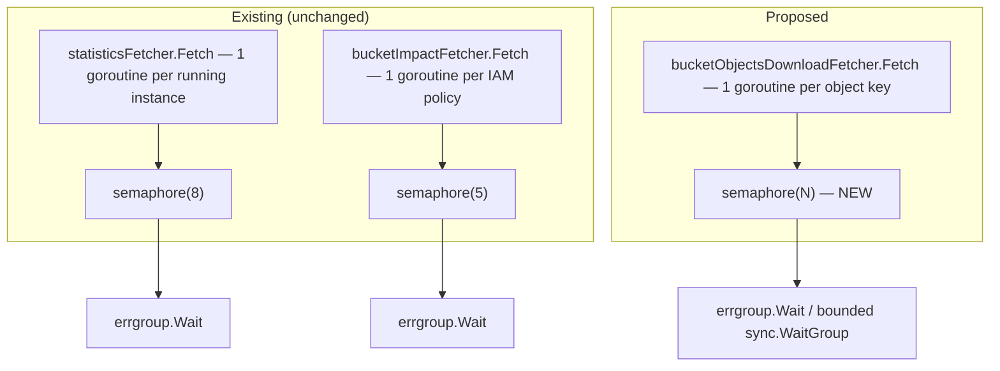

# ADR-0018: Bounded concurrency is the standard for per-item API/IO fan-out

## Status

Accepted (implemented)

## Context

`cloudctl` already has two places that fan a goroutine out per item in a collection to speed up
independent API calls, and both bound that fan-out with an `errgroup.WithContext` +
`chan struct{}` semaphore:

- `statisticsFetcher.Fetch` (`provider/aws/services/ec2/fetcher.go:101-114`) — one goroutine per
  running EC2 instance for a CloudWatch `GetMetricStatistics` call, bounded to
  `maxConcurrentCloudWatchCalls = 8`.
- `bucketImpactFetcher.Fetch` (`provider/aws/services/s3/impact_fetcher.go:76-90`) — one
  goroutine per customer-managed IAM policy for `GetPolicyVersion`/`ListEntitiesForPolicy`,
  bounded to `maxConcurrentIAMPolicyChecks = 5`. This bound was added live this session after
  the unbounded version made `ctl s3 impact` impractically slow against an account with 194
  policies — the same session also found and fixed two further bugs in that command (a
  wildcard-resource false-positive match and an unbounded/undeduped action list), all documented
  in ADR-0016.

One remaining site does **not** follow this pattern:
`bucketObjectsDownloadFetcher.Fetch`'s recursive path
(`provider/aws/services/s3/fetcher.go:210-268`) launches **one goroutine per object key with no
semaphore at all** (`fetcher.go:229-237`, `wg.Add(len(apiOutput.Contents))` then a bare `go`
per object). A prefix with thousands of objects launches thousands of concurrent
`downloader.Download` calls and `os.Create` file handles simultaneously — the same failure
shape already fixed twice elsewhere in this codebase, just not yet applied here. There is no
evidence this has caused a production incident, but there's also no reason to believe it's safe
at scale: nothing in the function scales its concurrency to the environment (open file
descriptor limits, S3/EC2 network bandwidth, or the destination disk).

Separately, the same function has an ordering bug: `wg.Wait()` (`fetcher.go:241`) blocks
**unconditionally** for every launched goroutine to finish, and only *after* that does it create
a `30 * time.Second` collection deadline (`fetcher.go:245`) for draining the results channel.
That deadline can never fire before all downloads are already done, defeating its own purpose
(bounding how long the command waits for results). Bounding the concurrency (this ADR) also
naturally bounds how long `wg.Wait()` can take in the worst case, which is the more direct fix
for the underlying concern than the deadline was trying to be.

The two fixed-width goroutine sites (`fetchInstanceDefinition`'s 2 goroutines,
`bucketConfigurationFetcher.Fetch`'s 5) are **not** in scope here — their fan-out width is fixed
by the number of API *dimensions* being fetched (volumes+rules; policy+version+tags+
encryption+lifecycle), not by the size of user-controlled input, so they can't grow unbounded
the way a per-object or per-policy fan-out can. This ADR is specifically about fan-out whose
width scales with external/user-controlled input size.

## Decision Drivers

- Two independent, already-shipped implementations of the same pattern is a signal this should
  be a documented convention, not tribal knowledge re-derived (or missed) at each new call site.
- The exact bug this ADR prevents was already found and fixed twice live this session
  (CloudWatch stats, then IAM policy checks) — a written rule reduces the chance of a fourth
  occurrence in future commands.
- No new abstraction is needed — `golang.org/x/sync/errgroup` is already a direct dependency,
  already used this way twice.

## Considered Options

### Option 1 — Leave the recursive download path unbounded

Advantages: zero change.

Disadvantages: known failure shape, already caused real problems twice elsewhere in this exact
codebase; large recursive downloads are a realistic use case for an S3 CLI tool.

### Option 2 — Bound it inline with a semaphore, matching the existing convention (chosen)

Add a `maxConcurrentObjectDownloads` constant and the same `errgroup.WithContext` + buffered
`chan struct{}` semaphore shape already used in `ec2/fetcher.go` and `s3/impact_fetcher.go`, and
document this shape as the standard for any future per-item fan-out.

Advantages: consistent with existing, working code (no new pattern to learn); small, isolated
diff; directly fixes the wait/deadline ordering bug as a side effect (bounded concurrency means
`wg.Wait()` can only ever have `maxConcurrentObjectDownloads` downloads in flight at once, so
overall wall-clock time becomes predictable and the 30s collection window can be re-scoped
meaningfully).

Disadvantages: none identified — this is a mechanical application of an already-proven pattern.

### Option 3 — Introduce a generic bounded-worker-pool helper type shared by all three call sites

Advantages: removes the small amount of duplicated semaphore boilerplate across 3 sites.

Disadvantages: 3 call sites with slightly different item types (`types.Instance`,
`types.Policy`, `types.Object`) would need a generic `WorkerPool[T]`-style abstraction purely to
avoid ~10 lines of duplication each already-tested and already-working — an unjustified
abstraction for the amount of duplication involved (violates "don't add abstraction without a
concrete need" from this repo's own established discipline, e.g. ADR-009's explicit rejection of
an `LLMProvider` interface with only one implementation). Rejected — the convention (documented
via this ADR) is the fix, not a new shared type.

## Decision

Every fan-out whose goroutine count scales with external/user-controlled input size must be
bounded via `errgroup.WithContext(ctx)` + a `chan struct{}` semaphore, sized conservatively
against the relevant API's known rate limits (matching the reasoning already documented inline
for `maxConcurrentIAMPolicyChecks`). Apply this to `bucketObjectsDownloadFetcher.Fetch`'s
recursive path now; treat it as the standing rule for any new per-item fan-out added later.
Fixed-width fan-out (bounded by the number of API dimensions, not input size) is unaffected by
this rule.

## Architecture

## Consequences

### Positive
- Removes the one remaining unbounded-fan-out site in the codebase.
- Fixes the wait/deadline ordering bug as a direct consequence, without a separate change.
- Future per-item fan-out has a documented, precedented pattern to follow instead of being
  re-derived (or missed) each time.

### Negative
- Very large recursive downloads (more objects than the chosen bound allows in flight) will take
  proportionally longer wall-clock time than the current unbounded version — a deliberate
  tradeoff (predictable resource usage over raw speed), consistent with the same tradeoff already
  accepted for IAM policy checks and CloudWatch stats.

### Risks
- Choosing too low a bound could make large downloads noticeably slower than before; choosing
  too high defeats the purpose. Mitigated by picking a starting value in the same range as the
  existing two sites (5–8) and treating it as tunable, not load-bearing precision.

## Migration Plan

1. Add `maxConcurrentObjectDownloads` (starting value in the 5–8 range, consistent with existing
   sites) to `provider/aws/services/s3/fetcher.go`.
2. Replace the unbounded `for _, content := range apiOutput.Contents { wg.Add(1); go
   downloadObject(...) }` loop with the same `errgroup.WithContext` + semaphore shape already
   used in `impact_fetcher.go`/`ec2/fetcher.go`.
3. Re-scope or remove the now-redundant 30s collection deadline once wait time is naturally
   bounded by the semaphore (needs a decision at implementation time: keep it as a safety net at
   a larger value, or remove it since bounded concurrency already caps worst-case wait time).
4. Add/extend a regression test exercising a large synthetic object list (mirroring the existing
   200-iteration regression-test style already used for the bucket-definition select-race fix)
   to confirm no goroutine-count blowup and correct result collection under the new bound.
5. `go test ./... -race`.

## Implementation Note

Implemented as designed: `bucketObjectsDownloadFetcher.Fetch`'s recursive path now uses
`errgroup.WithContext` + a `chan struct{}` semaphore bounded to
`maxConcurrentObjectDownloads = 8`, writing each result into a pre-sized `[]*objectDownloadSummary`
slice by index — the same shape as `statisticsFetcher.Fetch` and `bucketImpactFetcher.Fetch`. As
anticipated, this also fully resolves the wait/deadline ordering bug: the channel-based
collection loop and its ineffective 30s deadline were removed entirely (no longer needed —
overall wait time is now naturally bounded by the semaphore). The single-object download path
(no fan-out) was left untouched.

To make this testable, `bucketObjectsDownloadFetcher.client`'s field type changed from the
concrete `*s3.Client` to the existing minimal `listObjectsAPI` interface (already defined and
used by `bucketObjectsFetcher` for the same purpose) — no behavior change, purely enables a fake
in tests. A new regression test
(`TestBucketObjectsDownloadFetcher_Fetch_Recursive_BoundsConcurrency`) exercises the real
`errgroup`+semaphore code path against a fake `manager.DownloadAPIClient` that tracks peak
concurrent `GetObject` calls, confirming both that no results are lost (50/50 objects collected)
and that observed concurrency never exceeds the bound.

## Rollback Strategy

The change is isolated to one function (`bucketObjectsDownloadFetcher.Fetch`'s recursive path);
reverting to the unbounded loop is a single, independent diff with no effect on any other
command.

## Validation

- `go test ./... -race` passes, including the new/extended regression test.
- Manual check: recursively download a prefix with a meaningfully large number of objects and
  confirm the command completes correctly with the new bound in place (functionally identical
  output to before, different timing profile).
