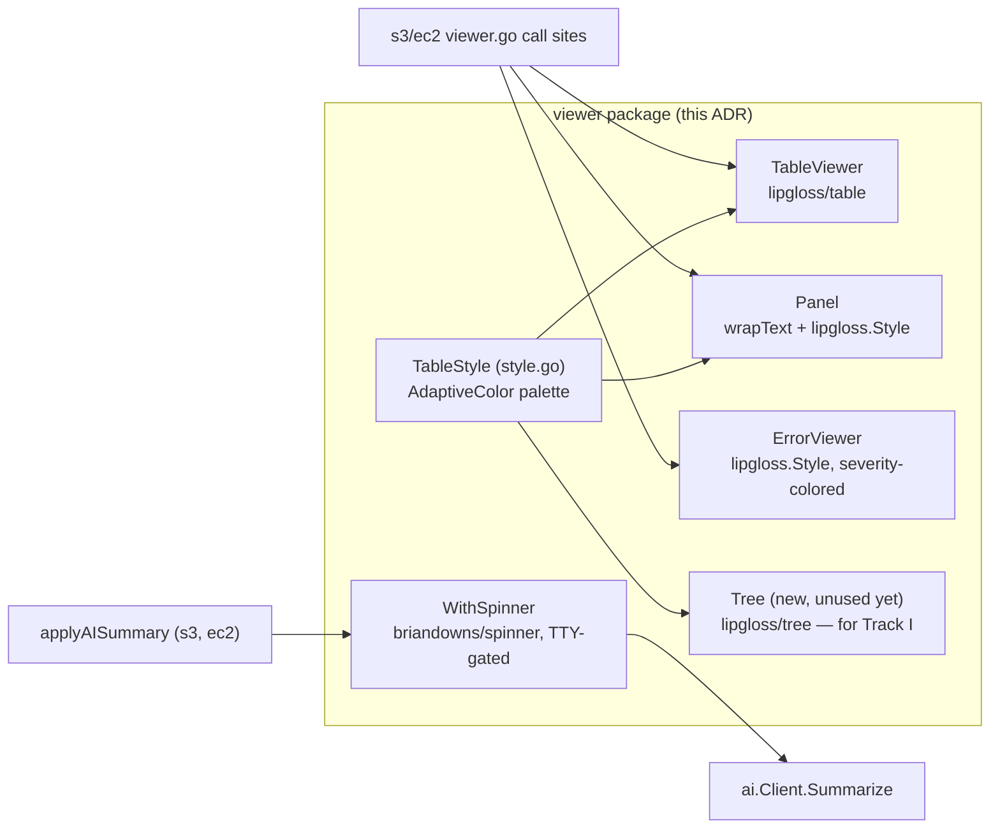

# ADR-0019: Adopt lipgloss as cloudctl's terminal rendering foundation

## Status

Accepted (implemented)

## Context

The user reported the CLI's tables and colors weren't readable — confirmed by inspecting the
actual `viewer/table.go`/`viewer/panel.go` implementation (`go-pretty/v6/table` +
`fatih/color`): `DefaultTableStyle()` combined four competing hues at once (cyan title, yellow
header, blue border, dim-gray alternating rows), `TableStyle.MaxWidth` defaulted to `0`
(unbounded), and no per-field wrapping existed for known-wide content — a bucket's IAM policy
JSON or a security group's action list rendered as one unbroken, terminal-stretching line.

Asked to choose a direction with research rather than a guess, I compared real-world adoption:
`charmbracelet/lipgloss` (~10.2k GitHub stars, actively maintained, January 2026 release) vs.
`pterm` (~5.4k stars) — and, concretely, that GitHub's own `gh` CLI uses lipgloss for this exact
kind of output. Beyond popularity, lipgloss has two capabilities the old stack lacked entirely:
`lipgloss.AdaptiveColor{Light, Dark}` (automatic light/dark-terminal color selection, rather than
a fixed guess that reads badly on the "wrong" background) and built-in `table`/`tree`
sub-packages, the latter a direct fit for hierarchical data arriving in Track I (VPC subnets,
EKS node groups).

## Decision Drivers

- The user's own words: not just "fix the current implementation" but explicitly open to
  changing the output structure, and asked for research-backed choices, not more options to
  litigate.
- Concrete, reproducible evidence of the actual problem (verified via live testing against real
  AWS data during implementation, see below) — not a redesign for its own sake.
- Consistency: every future command (Track I's DynamoDB, RDS, VPC, EKS, ElastiCache) should
  render on the same foundation from day one, not get retrofitted later.

## Considered Options

### Option 1 — Reconfigure go-pretty in place

Advantages: zero new dependency.

Disadvantages: go-pretty has no adaptive-color concept (any fixed palette risks reading badly on
one of light/dark terminals) and no tree component (Track I's VPC/EKS data would need a flat
table with a parent-ID column instead of a real hierarchy). Rejected once research surfaced a
better-suited, better-adopted alternative — matching the user's explicit "go find it" mandate.

### Option 2 — pterm

Advantages: comprehensive prebuilt components, less design work.

Disadvantages: meaningfully smaller community (~5.4k vs. ~10.2k stars), less precedent in
comparable tools, less low-level styling control. Rejected in favor of the more-adopted,
more-controllable option.

### Option 3 — lipgloss (chosen)

Advantages: proven at scale (GitHub's `gh` CLI), adaptive colors solve the light/dark problem
properly, native table + tree components cover both today's and Track I's needs, actively
maintained.

Disadvantages: larger migration (all of `viewer/`'s rendering, not just config values) — accepted
as in-scope per the user's explicit openness to structural change.

## Decision

Migrate `TableViewer`, `Panel`, and `ErrorViewer` onto lipgloss; add a `Tree` type (unused by any
command yet, scaffolded for Track I); remove `go-pretty` once nothing references it. Adopt a
committed palette via `lipgloss.AdaptiveColor` (one accent color for headers/titles, a neutral
border, semantic status colors reserved for future use, no alternating-row background). Add
`briandowns/spinner` for feedback during the local-LLM `Summarize` call (previously a silent
10–120s wait), gated behind the same `isInteractive()`-style TTY check already used for
credential prompts so it never pollutes piped output or test runs.

Two implementation-time corrections to the original design (documented here rather than
silently applied, since they changed the actual behavior from what was first planned):

1. **No default terminal-width cap on tables.** The plan called for capping every table to the
   detected terminal width. Live-tested against `ec2 ls`'s real 9-column, ID-heavy output, this
   made lipgloss/table's median-based column-shrinking algorithm wrap *every* column instead of
   the one that actually needed it — worse than the original unbounded rendering. `TableStyle`
   now defaults to natural (uncapped) width; only call sites with a genuinely oversized single
   field set `MaxWidth` explicitly.
2. **Panels needed wrap-without-pad, not lipgloss's built-in `Width()`.** `Style.Width()` both
   wraps *and* pads every line to the target width — a short one-line message would stretch to
   fill the full panel width regardless of how little text it contained. A small `wrapText`
   helper (word-wrap with hard-breaking for single tokens longer than the width, e.g. IAM policy
   JSON, which has no spaces at all) replaces it, so panels size to their actual content while
   still wrapping long fields.

## Architecture

## Consequences

### Positive
- Verified live against real AWS/Ollama output: a real IAM policy JSON, a real AI-generated
  paragraph, and a real long tag list all wrap cleanly within a content-sized panel — the
  original, most concrete complaint is directly fixed, not just theoretically addressed.
- Colors adapt correctly to the terminal's actual light/dark background instead of a fixed guess.
- One committed palette (`DefaultTableStyle()`) that every future command — including all of
  Track I — inherits automatically via `NewTableViewer()`/`NewPanel()`'s defaults.
- `go-pretty` removed — no orphaned dependency left behind.

### Negative
- Larger diff than a config-only fix would have been — all of `viewer/`'s rendering logic
  changed, not just style values. Mitigated by `Viewer`/`ViewerFunc[T]`/`CompoundViewer` (the
  actual command-facing contracts) being completely unchanged — every call site across
  `provider/aws/services/{ec2,s3}` needed zero changes.
- `TableStyle`'s less-used knobs from the old implementation (`SortBy`, `Compact`,
  `BorderStyle`, `HeaderStyle`, `AlternateRows`) were dropped rather than ported — confirmed via
  repo-wide grep that nothing outside `DefaultTableStyle()` itself ever set them to a non-default
  value, so nothing was lost in practice.

### Risks
- lipgloss/table's column-redistribution algorithm (Option 3's "no default width cap" correction)
  behaves non-obviously under a forced width with many similarly-wide columns — mitigated by
  defaulting to natural sizing and reserving explicit `MaxWidth` for the specific fields that
  actually need it (verified against real data, not just synthetic tests).

## Migration Plan

Completed in one pass (not phased) since `Viewer`/`ViewerFunc[T]` — the actual contract every
command depends on — never changed, making this a self-contained, atomic swap:
1. Add `charmbracelet/lipgloss@v1.1.0` and `briandowns/spinner@v1.23.2` at pinned versions
   (confirmed compatible with `go 1.22`/`toolchain go1.22.2`).
2. Rewrite `TableViewer`, `Panel`, `ErrorViewer` on lipgloss; add `Tree`, `WithSpinner`.
3. Wire `WithSpinner` into all four `applyAISummary` call sites (`ec2 def`, `ec2 explain`,
   `s3 def`, `s3 impact`).
4. `go mod tidy` to drop `go-pretty`.
5. Unit tests (`wrapText` edge cases, existing `IsErrorView`/`IsFailure` severity tests
   unaffected) + live verification against real AWS/Ollama output.

## Rollback Strategy

`Viewer`/`ViewerFunc[T]`/`CompoundViewer` and every call site in `provider/aws/services/*`
are unchanged, so reverting is isolated to `viewer/{table,panel,error,style,tree,spinner}.go`
plus the `go.mod`/`go.sum` dependency changes and the three `applyAISummary` call sites — a
single, self-contained revert with no ripple into command logic.

## Validation

- `go build`/`go vet`/`go test ./... -race` pass.
- Live-verified against real AWS + real Ollama output (`ec2 explain`, `s3 def`): IAM policy
  JSON, AI-generated prose, and long tag lists all wrap correctly within content-sized panels;
  `ec2 ls`'s multi-column ID table renders on one line per row with no forced wrapping.
- New regression tests for `wrapText` (short text unchanged, prose wraps at word boundaries,
  overlong single tokens hard-break, zero-width/empty-string edge cases).
