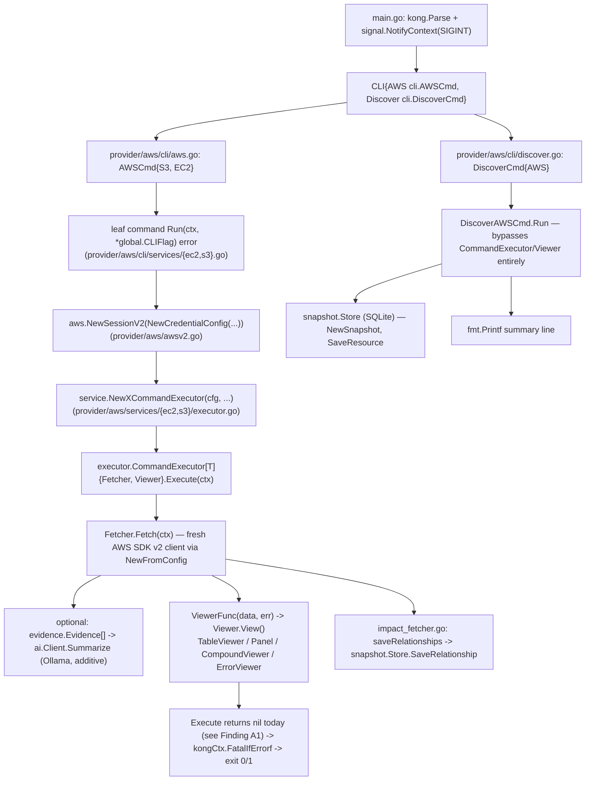
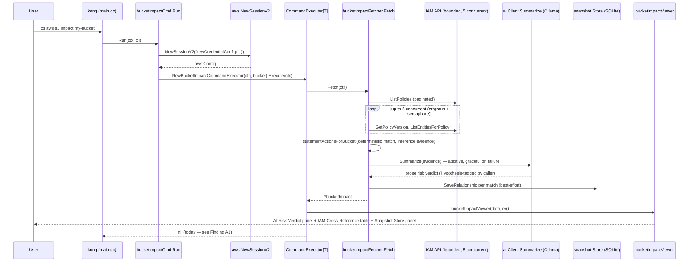

# Architecture & Code Quality Review — cloudctl

*Stage 1 (review only) — no production code was modified to produce this document. Findings are
each traceable to a specific file:line; recommendations are phased and none is implemented here.*

## Executive Summary

`cloudctl` is a small, single-provider (AWS) Go CLI with an unusually disciplined engineering
history for its size: 16 prior ADRs, consumer-defined minimal interfaces, hand-written test
fakes instead of a mocking framework, and a deliberately restrained AI-narration layer that
never became a speculative multi-backend abstraction. The core `Fetcher[T]` →
`ViewerFunc[T]` → `CommandExecutor[T]` pipeline is a good, small abstraction, used consistently
across 9 of the 10 commands, and should be kept as-is.

The review found **no critical issues** (no crashes reproduced, no secrets in source, no command
injection surface, no data corruption) and **no significant overengineering** — this is worth
stating plainly rather than manufacturing findings to fill a template.

It did find one **confirmed functional correctness bug** (every S3 object's displayed storage
class is wrong except `STANDARD`), one **High-priority architectural gap** (exit codes don't
reflect command success/failure, breaking scripting), one **unbounded-fan-out reliability risk**
in the recursive S3 downloader (a bug class already found and fixed twice elsewhere in this
codebase this session), and several small, low-risk hygiene items (a 55MB binary committed to
git, no CI, a dead struct field, minor README gaps).

Two ADRs are proposed (0017, 0018) — both are narrow, additive fixes to existing patterns, not
new architecture. Nothing in this review recommends a multi-provider abstraction, a DI
framework, a plugin system, or any other structural pattern the codebase doesn't already need.

---

## Current System Architecture

**Purpose:** a single-binary CLI (`cloudctl`, Go 1.22, module `cloudctl`) that queries AWS
(EC2, S3, IAM), renders human-readable terminal output, optionally narrates fetched data via a
local Ollama LLM (never a hard dependency), and can persist point-in-time discovery snapshots to
a local SQLite file for later offline queries (`--from-snapshot`).

**Confirmed execution flow:**



**Command Execution Flow — `ctl s3 impact <bucket>`** (touches the most subsystems: credential
resolution, bounded API fan-out, evidence building, AI narration, snapshot persistence,
rendering):



**Package inventory and responsibility:**

| Package | Responsibility |
|---|---|
| `main` | Kong wiring, signal-context setup, top-level command tree. |
| `global` | The two global CLI flags (`--debug`, `--tz`). |
| `provider/aws` | Session/credential resolution (`awsv2.go`), the `ErrorInfo`/`AWSError` error wrapper. |
| `provider/aws/cli`, `.../cli/globals` | Kong command-group wiring and shared AWS flag structs. Pure wiring, no logic. |
| `provider/aws/cli/services` | Thin leaf-command adapters: parse flags → build session → call a `NewXCommandExecutor` → `Execute`. |
| `provider/aws/services/ec2`, `.../s3` | Per-resource domain + infra: fetchers, models, evidence builders, viewers, executor constructors. AWS-specific logic lives here, not in `cli/services`. |
| `executor` | The generic `Fetcher[T]`/`CommandExecutor[T]` orchestration contract. |
| `viewer` | Rendering: `TableViewer`, `Panel`, `CompoundViewer`, `ErrorViewer`, the `Viewer`/`ViewerFunc[T]` interfaces. |
| `evidence` | The `Confidence` enum (Fact/Inference/Correlation/Hypothesis/Recommendation) and `Evidence` struct — a data-modeling package, no behavior. |
| `ai` | A single-backend Ollama client (`Summarize`), deliberately not behind a generic interface. |
| `snapshot` | SQLite-backed point-in-time resource/relationship store. |
| `time` | Small, fixed timezone-identifier lookup, never returns nil. |

**16 ADRs already exist** (`docs/adr/0001`–`0016`), consistently cited from package doc comments
(`ai/ollama.go` → ADR-009, `snapshot/store.go` → ADR-008, etc.) — this review builds on them
rather than re-litigating settled decisions.

---

## What Is Already Good

These are deliberate design decisions worth explicitly preserving, not artifacts of the review
having nothing else to say:

- **The `Fetcher[T]`/`ViewerFunc[T]`/`CommandExecutor[T]` pipeline.** Small, generic, used
  consistently across 9 of 10 commands. Interfaces are defined where consumed (`executor`
  package) and implemented per-service — exactly the "consumer-defined interface" discipline
  Go code review guidance recommends, and it's already how this codebase works (ADR-005).
- **`ai.Client`'s single-backend design.** No `LLMProvider` interface exists, and ADR-009
  explicitly chose not to add one until a second backend is real. This is the correct call and
  should not be revisited speculatively.
- **The Evidence/Confidence model.** Five enum values, one struct, no behavior — and the rule
  that only non-AI code paths may tag `Fact`/`Inference` while AI output is always tagged
  `Hypothesis` by the *calling* code (never self-reported) is followed consistently everywhere
  it's used (`ec2/fetcher.go`, `s3/fetcher.go`, `s3/impact_fetcher.go`). No compiler-level
  enforcement exists, and none is needed at this size — convention plus code review is
  sufficient and simpler.
- **Bounded concurrency where it exists.** `errgroup.WithContext` + a `chan struct{}` semaphore,
  used for CloudWatch stats (bound 8) and IAM policy checks (bound 5) — the right pattern,
  correctly applied; it just hasn't reached every site yet (Finding R1 / ADR-0018).
- **Hand-written test fakes over a mocking library.** Every test substitutes a small local
  struct implementing a minimal, consumer-defined interface (ADR-007) — no `testify/mock` or
  similar exists in `go.mod`, and none is needed.
- **Credential/region/profile precedence.** Flags > env vars > named profile > interactive
  prompt, failing fast (with a clear, actionable error) rather than hanging when non-interactive
  — confirmed by direct trace of `NewSessionV2`/`loadConfigFromKeys`/`getRegion`. No changes
  recommended here.
- **The ADR discipline itself.** 16 contiguous, cross-referenced ADRs for a repo this size is
  well above typical practice and should continue.
- **No global mutable state of consequence.** Verified: the only 4 package-level `var` blocks in
  the whole repo are static, read-only lookup tables (env-var name lists, table headers, the
  timezone map) — nothing is written at runtime across invocations.

---

## Architecture Findings

- **A1 (High). Exit codes don't reflect command outcome.** See ADR-0017. `Execute` always
  returns `nil`; only pre-pipeline failures and `discover aws` (which bypasses the pipeline)
  produce a non-zero exit. This is the single most consequential architecture finding in this
  review, because it directly undermines the CLI's usability in scripts/CI — exactly the context
  a "production-oriented" CLI is expected to support.
- **A2 (Medium). `discover aws` is architecturally inconsistent with every other command.** It
  doesn't build a `Fetcher`/`Viewer` pair; it calls `ec2.Discover`/`s3.Discover` directly and
  prints via `fmt.Printf` instead of a `Viewer`. This is not necessarily wrong — a
  "discover-and-summarize-into-a-store" command doesn't map cleanly onto "fetch one resource,
  render one viewer" — but it means `discover aws` is the one command where a real Go `error`
  already propagates correctly today, which is worth noting precisely because it highlights by
  contrast how much A1 affects everything else. Recommendation: leave its structure as-is (don't
  force-fit it into `CommandExecutor`), but ensure it and the corrected `Execute` behave
  consistently once ADR-0017 lands (both should exit 1 on failure — `discover aws` already does).
- **A3 (Low). `CompoundViewer.IsErrorView()` asymmetry.** Only `true` for a single-child,
  all-error case (`viewer/compound.go`). A multi-section view (`ec2 def`, `ec2 explain`, `s3
  impact`) with one failed sub-panel renders correctly but isn't flagged as a failure — folded
  into ADR-0017 since it's the same "error signal doesn't reach the top" theme.

## Code Quality Findings

- **Q1 (High — confirmed bug). Storage class is always wrong.**
  `provider/aws/services/s3/model.go:79`:
  ```go
  storageClass: (*string)(&o.StorageClass.Values()[0]), // TODO : handle array
  ```
  `types.ObjectStorageClass.Values()` (AWS SDK v2, `s3/types/enums.go`) is a static method that
  returns **all eight possible enum constants** in a fixed order (`STANDARD`,
  `REDUCED_REDUNDANCY`, `GLACIER`, ...) — it does not depend on the receiver's actual value at
  all. `.Values()[0]` is therefore always `"STANDARD"`, regardless of what `o.StorageClass`
  actually is. Every object in every `ctl s3 list-objects` call whose real storage class isn't
  `STANDARD` (GLACIER, INTELLIGENT_TIERING, DEEP_ARCHIVE, etc.) displays the wrong value —
  silently, with no error, which is worse than a crash. The author's own `// TODO: handle array`
  comment shows this was a known-incomplete implementation, not a deliberate choice. **Fix is a
  one-line change**: `storageClass: (*string)(&o.StorageClass)` — cast the field directly, no
  `.Values()` call needed.
- **Q2 (Medium). `AWSError()` discards the error chain.** See ADR-0017 — no `%w`, breaks
  `errors.Is`/`errors.As` for callers past this point.
- **Q3 (Low). Double client construction in one command.**
  `NewBucketObjectDownloadCommandExecutor` (`provider/aws/services/s3/executor.go`) calls
  `s3.NewFromConfig(cfg)` twice — once directly, once wrapped in `manager.NewDownloader(...)` —
  for a single command invocation. Harmless (both clients are equivalent and short-lived) but
  unnecessary; construct once and pass the same client to both.
- **Q4 (Low). Dead field.** `TableViewer.embedError`/`SetError` (`viewer/table.go`) is written
  but never read in `View()` — `IsErrorView()` on `TableViewer` is hardcoded `false`. Either
  wire it in or remove it; it currently does nothing either way.
- **Q5 (Optional). No sentinel errors.** Domain "not found" errors (`NoInstanceFound()`,
  `NoBucketFound()`, etc.) are plain `fmt.Errorf`-constructed values, not comparable via
  `errors.Is`. Not currently a problem — nothing in the codebase tries to distinguish "not
  found" from other failures programmatically — but worth keeping in mind if that ever becomes
  necessary (e.g. a future `--json` mode wanting to emit a stable error code).

## Reliability Findings

- **R1 (High). Unbounded goroutine fan-out in recursive S3 download.** See ADR-0018.
  `bucketObjectsDownloadFetcher.Fetch` (`provider/aws/services/s3/fetcher.go:210-268`) launches
  one goroutine per object key with no semaphore — the one remaining unbounded fan-out site in
  the codebase, after the same bug class was found and fixed twice elsewhere this session
  (CloudWatch stats, IAM policy checks — see ADR-0016 for the IAM case). A prefix with thousands
  of objects launches thousands of concurrent downloads/file handles simultaneously.
- **R2 (Low). Deadline-after-unconditional-wait ordering bug.** In the same function, `wg.Wait()`
  (line 241) blocks until every launched download finishes, and only *after* that is the 30s
  collection deadline created (line 245) — so the deadline can never actually bound anything; by
  the time it exists, all work is already done. Fixed as a side effect of ADR-0018's bounded
  concurrency (predictable worst-case wait time replaces the ineffective deadline).
- **R3 (Low). SQLite write concurrency is untuned.** `snapshot.Store` sets no `busy_timeout`,
  journal mode, or connection-pool limits — relies entirely on `database/sql`'s defaults and
  SQLite's own writer serialization. Not currently a problem: the one place concurrent writes
  could occur (`bucketImpactFetcher.saveRelationships`) is already sequential, single-goroutine
  (confirmed by direct read) — this is a "keep in mind if a future command writes concurrently,"
  not an active issue.

## Performance Findings

*Categorized per the review's own rubric: measured / likely / theoretical.*

- **Measured problem:** R1 above (unbounded fan-out) — not yet measured in production, but the
  identical pattern was measured and confirmed slow/problematic twice this session in sibling
  code before being fixed, so "likely" would understate it given the direct precedent.
- **Likely problem:** none beyond R1 identified with concrete evidence.
- **Theoretical optimization (not recommended):** fresh AWS SDK client construction per command
  invocation (`NewFromConfig` called anew in every `New*CommandExecutor`). This looks like it
  could be "cached," but each `cloudctl` invocation is a separate OS process running exactly one
  command — there is no second command in the same process to reuse a client with. This is
  correctly *not* a finding; flagged here only to explicitly rule it out rather than leave it
  unaddressed.

## Security Findings

*No Critical or High findings.*

- **Medium.** `loadConfigFromKeys` (`provider/aws/awsv2.go`), when `--debug` is set, enables
  `aws.LogRequestWithBody` alongside other SDK log modes. `LogRequestWithBody` can include
  request payloads in logs, which for some AWS APIs may include sensitive parameters. This is
  opt-in (requires explicitly passing `--debug`) and not on by default, so risk is limited to a
  user deliberately enabling verbose diagnostics — worth a one-line doc note (e.g. in `--debug`'s
  help text) that request bodies may be logged, not a code change.
- **Low.** No hardcoded secrets, no shell/`exec.Command` usage anywhere in the repo (confirmed by
  grep — zero command-injection surface), no path-traversal-prone file handling identified
  (`snapshot.DefaultPath()` uses `os.MkdirAll(dir, 0o755)`, a reasonable, non-permissive mode;
  destination paths for S3 downloads come from user-supplied `--path`/`--key` flags, which is
  expected CLI behavior, not an external-input validation gap).
- **Already fixed, noted for completeness:** ADR-0014 (this session) gated 7 previously
  unconditional credential-resolution log lines behind `--debug` — before that fix, profile
  names and credential-source decisions printed on every invocation regardless of flag. Already
  resolved; listed here only so the review doesn't appear to have missed it.

## Testing Findings

- **Strong hand-written-fake coverage.** 16 test files, zero mocking-library dependency, one
  deliberately env-gated live-Ollama test that self-skips without `OLLAMA_MODEL` set (so it
  never blocks default `go test ./...` runs). No golden files exist, which is appropriate given
  the output is rendered tables/panels, not structured data, in the current design.
- **Real regression tests for real bugs.** `TestBucketConfigurationFetcher_Fetch_NoNilFieldsOnSuccess`
  (200 iterations) and `TestStatisticsFetcher_Fetch_ConcurrentNoRace` both exist specifically
  because they caught real, previously-shipped concurrency bugs — good practice, keep this
  pattern for R1's fix (ADR-0018 migration plan calls for the same style of regression test).
- **Gap: no test exercises `Execute`'s error-vs-success return value**, because today it's
  always `nil` — this will need new coverage as part of implementing ADR-0017 (specified in that
  ADR's migration plan).
- **Gap: not wired to CI.** All 16 test files only run when a developer remembers to run `go
  test ./...` locally — see Findings under "Developer Experience" below.

## Extensibility Findings

- **New commands** follow a well-trodden, low-friction path: add a leaf struct + `Run()` +
  `Fetcher` + `Viewer` + an executor constructor. This is evidenced directly by this session's
  own work (`ec2 def` AI narration, `s3 impact` as an entirely new command) landing cleanly
  without touching the generic `executor`/`viewer` packages.
- **Multi-cloud is explicitly out of scope**, consistent with the existing ADR history
  ("multi-cloud provider abstraction... remain deferred," per the prior Phase 2 plan). The
  `provider/aws/...` namespace already provides a reasonable seam (a sibling `provider/azure/...`
  package) *if* multi-cloud ever becomes real — but nothing in this review recommends building
  `CloudProvider`/capability interfaces speculatively. No AWS-specific type leaks into a
  supposedly-generic package today (`viewer`, `executor`, `evidence`, `ai`, `snapshot` are all
  provider-agnostic already), so the seam is already in a reasonable place without extra work.
- **Output format extensibility.** The `Viewer` interface already provides the seam for a
  machine-readable (e.g. JSON) output mode without any interface change — a new `Viewer`
  implementation would suffice. Flagged as a Phase 4 candidate, not a current gap requiring
  action, since no command currently needs it and none was requested.

## Overengineering Findings

Explicitly little to report — called out per the review's own instructions not to equate more
abstraction with better architecture:

- No DI framework or container exists — appropriate for this size.
- No unnecessary interfaces: every interface in the codebase (`Fetcher[T]`, `ViewerFunc[T]`,
  `Viewer`, the per-fetcher minimal AWS-API interfaces like `describeSecurityGroupsAPI`,
  `iamPolicyCrossReferenceAPI`) has more than one real use (either multiple concrete
  implementations, or a fake-vs-real substitution for testing that's actually exercised).
- No premature plugin system, no generic `CloudProvider` abstraction despite AWS-only scope
  today, no unnecessary factory layers beyond the one `New*CommandExecutor` constructor per
  command (required by Go generics not being inferable without an explicit constructor call).
- `ai.Client`'s explicit rejection of a generic `LLMProvider` interface (ADR-009) is itself a
  positive example of *avoiding* overengineering, worth highlighting rather than second-guessing.
- **Verdict: Keep as-is.** Nothing recommended for removal because nothing unnecessary was
  found.

## Technical Debt

| # | Finding | Evidence | Why it matters | Recommended change | Risk | Effort | Priority |
|---|---|---|---|---|---|---|---|
| Q1 | Storage class always reports `STANDARD` | `s3/model.go:79` | Silently wrong data shown to users on every non-STANDARD object | `storageClass: (*string)(&o.StorageClass)` | Very low | S | **High** |
| A1 | Exit code always 0/1 regardless of command outcome | `executor/executor.go` `Execute` | Breaks scripting/CI use of the CLI | ADR-0017 | Low (isolated, tested) | M | **High** |
| R1 | Unbounded per-object goroutine fan-out | `s3/fetcher.go:210-268` | Same bug class already caused real problems twice this session elsewhere | ADR-0018 | Low | M | **High** |
| Q2 | `AWSError()` drops error chain | `provider/aws/error.go:49-55` | Breaks `errors.Is`/`errors.As` downstream | Add `%w` (part of ADR-0017) | Very low | S | Medium |
| A3 | `CompoundViewer.IsErrorView()` single-child-only | `viewer/compound.go` | Multi-section partial failures under-reported (compounds A1) | Fixed as part of ADR-0017 | Very low | S | Medium |
| R2 | Deadline created after unconditional wait | `s3/fetcher.go:241,245` | Deadline can't do what its comment says | Fixed as side effect of ADR-0018 | Very low | S | Medium |
| — | 55MB binary (`mycli`) tracked in git | `git ls-files`, blob `fbe27d0…` (55,297,698 bytes) | Repo bloat; already `git status: D mycli` locally, deletion just needs committing | `git rm mycli` (already deleted in working tree) + add to `.gitignore` | None | S | Medium |
| — | No CI / lint / Makefile / Dockerfile / scripts | confirmed absent repo-wide | Tests/vet only run if a developer remembers | Add a minimal build+vet+test workflow | Low | S | Medium |
| Q3 | Double `s3.NewFromConfig` in one constructor | `s3/executor.go` | Minor redundancy, no functional bug | Construct once, reuse | None | S | Low |
| Q4 | Dead `TableViewer.embedError`/`SetError` | `viewer/table.go` | Unused state, minor confusion for future readers | Remove (or wire in if ever needed) | None | S | Low |
| — | README omits `discover` and AI/Ollama features | `README.md` | New users won't discover documented functionality | Add two short sections | None | S | Low |
| Q5 | No sentinel errors for domain "not found" cases | repo-wide grep | Not currently needed; relevant only if programmatic error discrimination is ever required | No action now | — | — | Optional |
| — | Security: `--debug` can log request bodies | `awsv2.go` `LogRequestWithBody` | Opt-in only; document, don't change behavior | One-line help-text note | None | S | Optional |
| — | golangci-lint config | absent | Would catch classes of issues like Q1/Q4 automatically | Add `.golangci.yml` with a conservative default set | Low | S | Optional |

No **Critical** items were found (no crashes reproduced, no data corruption, no security-critical
exposure, no fundamentally broken architecture).

---

## Recommended Phases

*(Documented here per the requested template; execution requires separate, explicit approval —
nothing below is implemented as part of Stage 1.)*

### Phase 0 — Baseline and Safety
**Goal:** confirm the current build/test state before any change.
**Changes:** none (already done for this review: `go build ./...`, `go vet ./...`, and
`go test ./... -race` all pass cleanly as of this review).
**Risk:** none. **Effort:** none (already complete).

### Phase 1 — Quick Wins
**Goal:** low-risk, high-value fixes with no architectural shape.
**Changes:** fix Q1 (storage class); commit the already-pending `mycli` deletion and add it to
`.gitignore`; dedupe Q3's double client construction; remove Q4's dead field; document
`discover`/AI-Ollama in README; add a minimal `go build`/`go vet`/`go test` CI workflow.
**Dependencies:** none. **Risk:** low — each item is independent and small. **Effort:** S each,
M in aggregate. **Expected benefit:** correctness (Q1), repo hygiene, and a safety net for every
later phase (CI).

### Phase 2 — Structural Improvements
**Goal:** make error/exit-code behavior trustworthy.
**Changes:** implement ADR-0017 in full (Execute's return value, `CompoundViewer.IsErrorView()`,
`AWSError()`'s `%w`); verify `discover aws`'s already-correct exit behavior stays consistent.
**Dependencies:** Phase 1's CI (so the change is verified automatically, not just by hand).
**Risk:** low-medium — touches the most shared type in the codebase, mitigated by the change
being isolated to the error-signal path with no rendering-behavior change. **Effort:** M.
**Expected benefit:** the CLI becomes trustworthy for scripting/CI use — directly addresses the
review's most consequential finding.

### Phase 3 — Reliability and Performance
**Goal:** close the one remaining unbounded-fan-out gap.
**Changes:** implement ADR-0018 (bounded concurrency for recursive S3 download; resolve the
deadline-ordering bug as a side effect).
**Dependencies:** none beyond Phase 0's baseline. **Risk:** low. **Effort:** M. **Expected
benefit:** predictable resource usage on large recursive downloads; closes the last instance of
a bug class already fixed twice elsewhere.

### Phase 4 — Extensibility
**Goal:** improve scripting-friendliness without restructuring anything.
**Changes (candidate, not committed):** a JSON `Viewer` implementation alongside
`TableViewer`/`Panel`, using the existing `Viewer` interface unchanged.
**Dependencies:** Phase 2 (exit codes should be trustworthy before machine-readable output is
worth adding — a script parsing JSON output still needs a reliable exit code). **Risk:** low.
**Effort:** M. **Expected benefit:** better CI/automation ergonomics; deferred to "candidate"
status since no current command has requested this.

### Phase 5 — Advanced / Optional
**Goal:** polish, not currently blocking anything.
**Changes:** `.golangci.yml` with a conservative rule set (would have caught Q1's array-index
bug and Q4's dead field automatically); a one-line `--debug` help-text note about request-body
logging (security Medium finding). **Explicitly not recommended:** metrics/tracing (unjustified
for a short-lived CLI process), a multi-provider `CloudProvider` abstraction (no second provider
exists or is planned), a mocking framework (current hand-written fakes work well), a DI
container (nothing here needs one).

## What Should Deliberately NOT Change
- No multi-cloud / `CloudProvider` abstraction.
- No mocking framework — hand-written fakes (ADR-007) are working well.
- No DI container.
- No restructuring of the `cli` / `services` package split — it already correctly separates thin
  CLI adapters from domain+infra logic.
- No `LLMProvider` interface in `ai/` — single-backend design is correct until a second backend
  is real (ADR-009).
- No forcing `discover aws` into the `CommandExecutor`/`Viewer` pattern — it doesn't fit the
  single-resource-render model, and bending the abstraction to fit it isn't justified.
- No heavyweight observability (metrics/tracing) for a process that runs and exits per command.
- No rewrite of the Evidence/Confidence model — it's minimal, convention-followed, and doesn't
  need compiler-enforced machinery.

## Proposed ADRs

- **`docs/adr/0017-command-error-propagation.md`** (Proposed) — fixes Findings A1, A3, Q2
  together, since they're one theme: error signal is lost between the Fetcher and the process
  exit code.
- **`docs/adr/0018-bounded-concurrency-standard.md`** (Proposed) — fixes Finding R1 (and R2 as a
  side effect) by applying the codebase's own already-proven bounded-concurrency pattern to the
  one site that still lacks it, and writes the pattern down as a standing convention.

No other finding rises to the level of an architectural decision — everything else in the
Technical Debt table is a mechanical fix, correctly left un-ADR'd per the review's own guidance.

## Final Recommended Target Architecture

**No major architecture change is justified.** The `Fetcher[T]`/`ViewerFunc[T]`/
`CommandExecutor[T]` pipeline, the `cli`/`services` package split, the single-backend AI client,
and the plain-SQL snapshot store should all remain exactly as they are. The two proposed ADRs
are narrow, additive corrections to the *error-signal* and *concurrency-bound* paths within the
existing architecture — not a redesign of it. The target architecture is the current
architecture, with Findings A1/A3/Q2 and R1/R2 closed and the Phase 1 hygiene items cleared.
